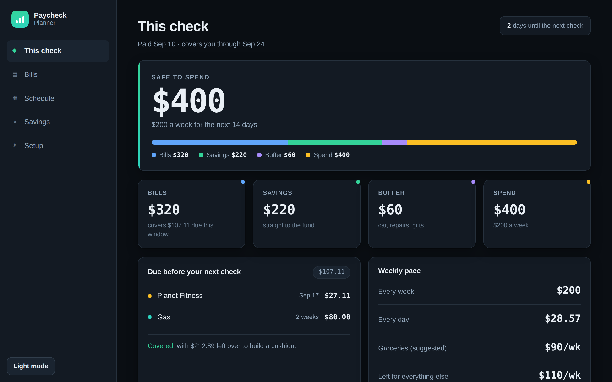
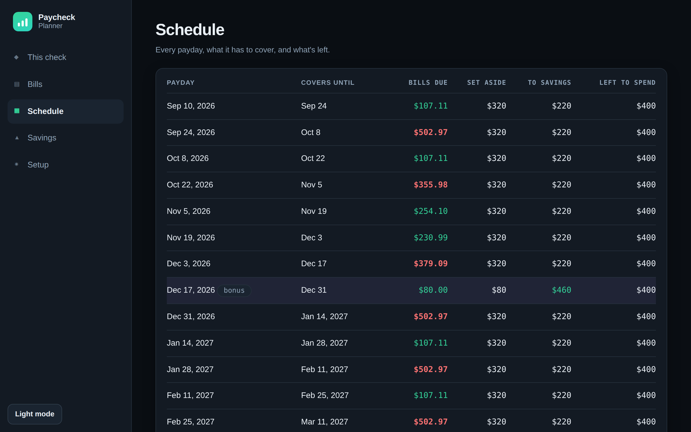
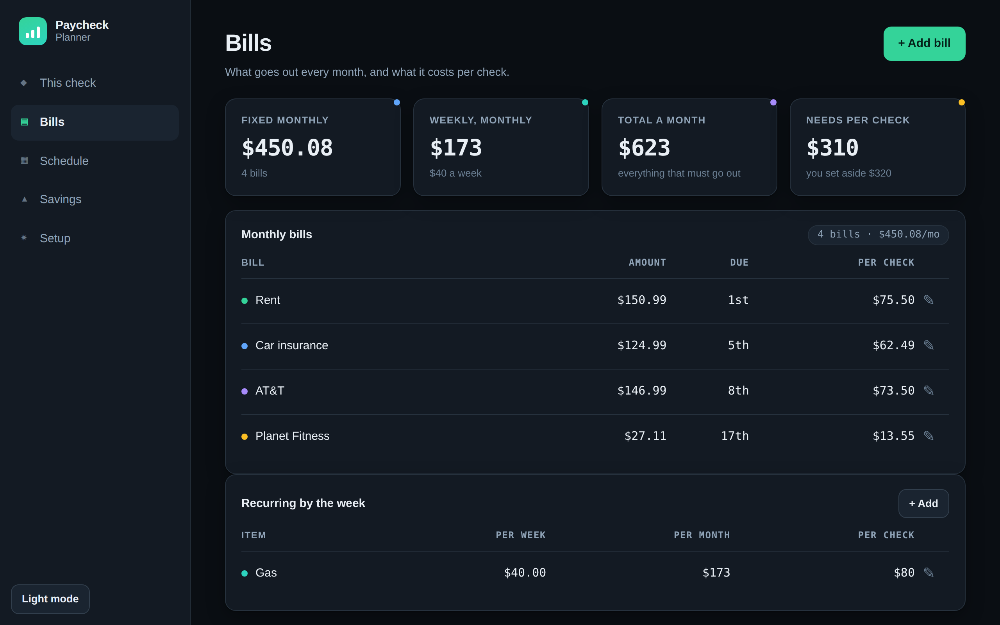
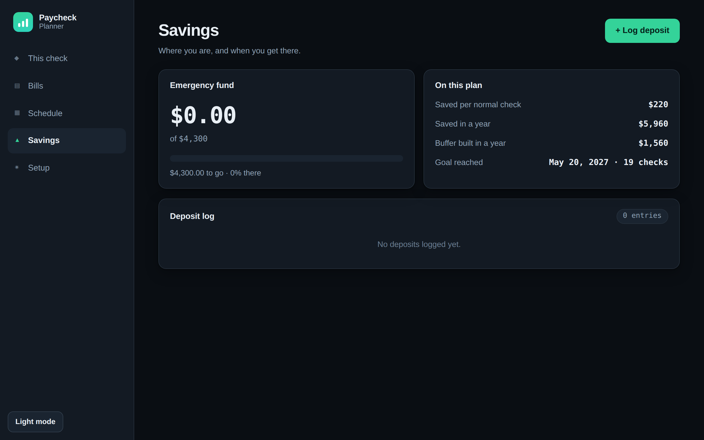
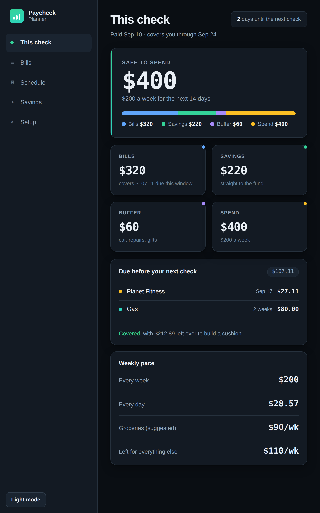

# Paycheck Planner

An offline Android budget app for people paid every two weeks. It answers three
questions on every payday:

- **How much can I actually spend this check?**
- **What has to go to bills before the next one lands?**
- **What goes to savings?**

No account, no network, no permissions. Everything is stored on the tablet.



| | |
|---|---|
|  |  |
|  |  |

## Install it

1. Copy `dist/paycheck-planner.apk` to the tablet (USB, Drive, or email it to yourself).
2. Open it with **Files** → tap the APK.
3. Android will ask to allow installs from that app — allow it, then **Install**.
4. It shows up as **Paycheck Planner**.

Samsung tablets running One UI 5 or newer all work; the minimum is Android 6.0.

Nothing is sent anywhere, so the "unknown app" warning is just Android telling
you this did not come from the Play Store.

## How it works

Each paycheck is split into four buckets:

| Bucket | Default | What it is |
|---|---|---|
| Bills | $320 | Set aside for rent, insurance, phone, gym, gas |
| Savings | $220 | Straight to the emergency fund |
| Buffer | $60 | Car repairs, registration, doctor, gifts |
| Spend | $400 | Groceries and everything else — $200/week |

The **Schedule** tab walks forward through every payday and shows what is due
before the next one arrives, so the months where rent and insurance land in the
same window do not catch you out. Checks with nothing due before the next payday
are flagged as **bonus** and their bills set-aside rolls into savings.

The defaults are loaded from a starting budget — open **Setup** and **Bills** to
change income, payday, amounts and due dates to whatever is actually true.

### Your data

It lives in the WebView's local storage on that one tablet. It is not backed up
to a cloud and it does not survive uninstalling the app. **Setup → Backup** shows
a block of text: copy it somewhere safe now and then, and paste it back into the
same box to restore.

## Build it yourself

The build deliberately avoids Gradle and the Android Gradle Plugin, because both
pull the SDK from `dl.google.com`. Everything here comes from Debian/Ubuntu
packages instead:

```bash
sudo apt-get install -y aapt zipalign apksigner dalvik-exchange \
     android-sdk-build-tools android-sdk-platform-23 openjdk-21-jdk-headless
./build.sh
```

The APK lands in `dist/`. The pipeline is:

```
aapt2 compile  →  aapt2 link  →  javac (--release 8)  →  dx  →  zipalign  →  apksigner
```

`build.sh` generates `keystore/planner.keystore` on the first run and reuses it
after that. Keep that file — Android only lets you update an installed app in
place if the new APK is signed with the same key. It is gitignored; if you lose
it you have to uninstall before reinstalling.

### Layout

```
app/
  AndroidManifest.xml          minSdk 23, targetSdk 34
  src/com/paycheckplanner/     MainActivity — a WebView and nothing else
  res/                         theme, strings, launcher icon
  assets/                      index.html, app.css, app.js — the actual app
tools/
  mkicon.py                    writes the launcher PNGs, no image libraries
  smoke.js                     runs app.js against a DOM shim, checks the math
build.sh
```

The app is compiled against API 23 (the newest `android.jar` Debian ships) but
declares `targetSdk 34`, which is what governs runtime behaviour on the device.
Nothing in `MainActivity` calls an API newer than 23.

### Tests

```bash
node tools/smoke.js
```

Runs the real `app.js` against a minimal DOM shim with the date pinned, and
asserts the payday windows, the bill totals and the bucket math.
